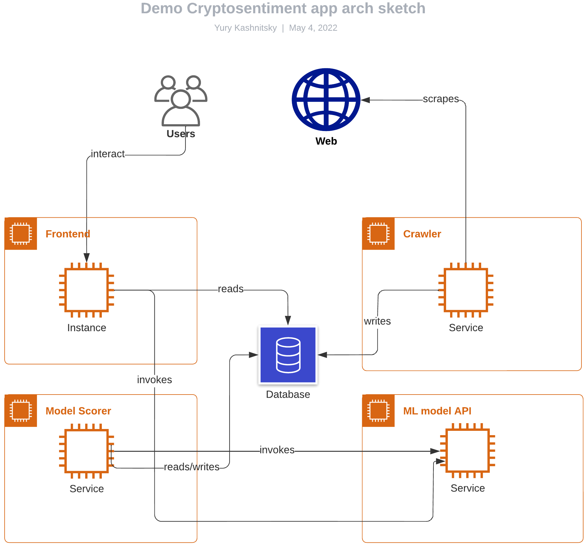
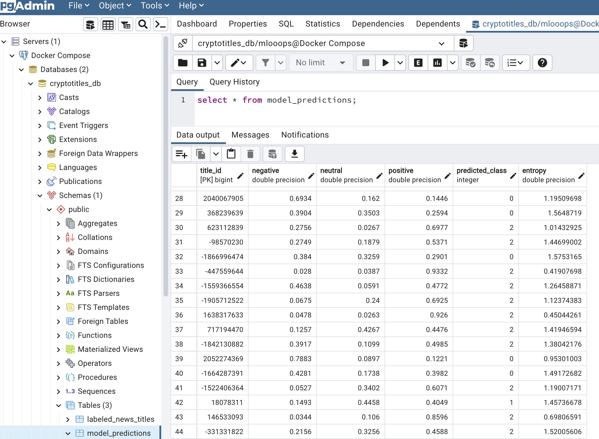
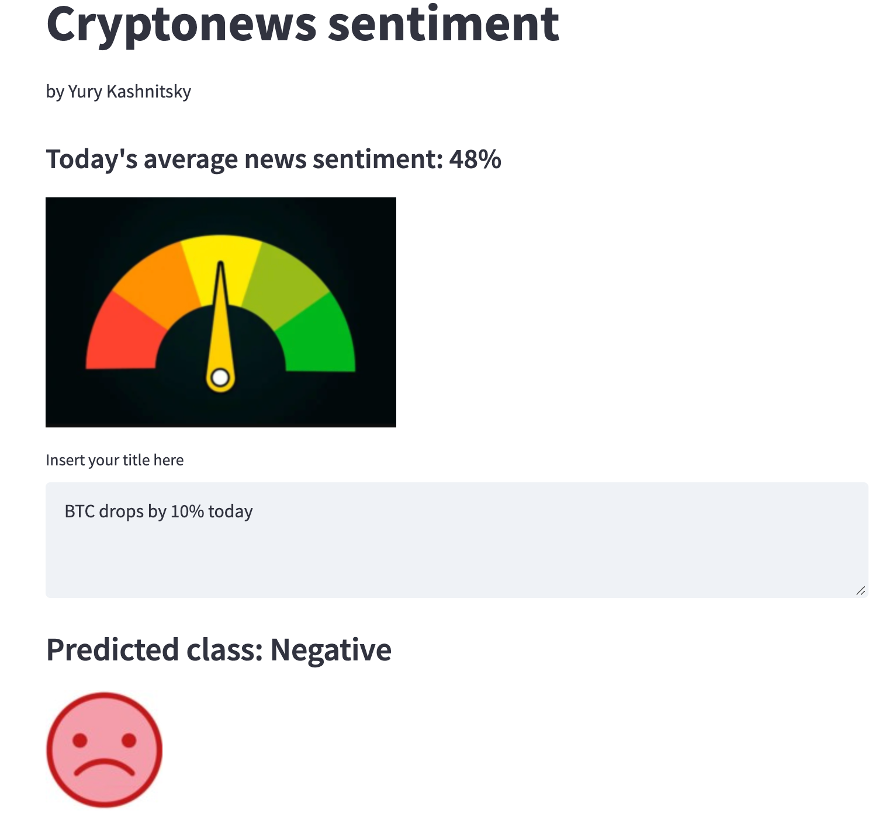

# Cryptonews sentiment demo app

This is a demo cryptonews sentiment prediction application. Its goal is to create an MVP and also create a prototype for the interaction of all components. The components themselves are mocks at the moment, to be superseded by more advanced ones.

<center>

</center>

The general idea of the workflow is the following (__bolded__ verbs below correspond to arrows in the diagram above):

- `Database` (PostgreSQL) stores 3 tables: one for raw news titles (title\_id, title, source, timestamsp), one more for model predictions (title\_id, negative, neutral, positive, predicted_class, entropy), and a third one for labeled news titles (title\_id, label, timestamsp)
- `Crawler` periodically __scrapes__ 50 latest news from [https://bitcointicker.co/news/](https://bitcointicker.co/news/) and __writes__ this data to the `Database`;
- `ML model API` service hosts the ML model inference API (model training is not covered here);
- the `Model Scorer` service periodically __reads__ those news titles from the `Database` that lack model predictions, __invokes__ `ML model API` for these fresh titles and __writes__ the result to the `Database`;
- `Data Provider` service __reads__ news titles from the `Database` with its model predictions and provides it to `Frontend` via API;
- `Frontend` __reads__ a metric (average sentiment score for all news titles for the last 24 hours) from the `Data Provider` and visualizes it as a barometer. Also, users __interact__ with `Frontend` by inserting news titles (i.e. free text), for which `Frontend` __invokes__ `ML model API` to show predictions for the corresponding user-input news titles;
- `Scheduler` (not yet depicted) launches `Crawler` and `Model Scorer` on a schedule, e.g. 4 times a day.

## Running the app

All components except for the database are packed together and managed by `docker-compose`. See [`docker-compose.yml`](docker-compose.yml) which lists all services and associated commands. At the moment, the database is spun up separately, manually.

**Preparation:**

 - install [`docker`](https://docs.docker.com/engine/install/ubuntu/) and [`docker-compose`](https://docs.docker.com/compose/install/). Tested with Docker version 20.10.14 and docker-compose v2.4.1 (make sure it's docker-compose v2 not v1, we had to add the path to docker-compose to the PATH env variable: `export PATH=/usr/libexec/docker/cli-plugins/:$PATH`);
 - put variables from [this Notion page](https://www.notion.so/d8eaed6d640640e59704771f6b12b603) (section "Project env variables", limited to project contributors) in the `.env` file, see `.env.example`
 - check `db_setup/pgadmin` and `db_setup/postgres` permissions, if they are root-only, run `sudo chown -R <username> <folder_name>; sudo chmod -R 777 <folder_name>`for both folders (otherwise, they won't be accessible inside docker);
 - put the model pickle file into `static/models` (later this will be superseded by MLFlow registry), at the moment the model file `/artifacts/models.logit_tfidf_btc_sentiment.pkl` is stored on the Hostkey machine (limited to project contributors) ;

**To launch the whole application:**

```
docker compose -f docker-compose.yml --profile production up --build
```

This will open a streamlit app `http://<hostname>:8501` in your browser, see a screenshot below in the [Frontend](#frontend) section.

**To train the model:**

 - select model config in the conf/config.yaml file. Available configs can be found in the conf/models folder.
 - place data in the data folder. Specify the path to the data in the config (path_to_data key). This will be replaced with reading from a database.
 - make sure that other services are stopped: `docker compose stop` and `docker compose rm`.
 - run the following command

```
USER=$(id -u) GROUP=$(id -g) docker compose -f docker-compose.yml --profile train up --build
```

The model checkpoint will be saved with the path specified with `checkpoint_path` key in the model config. Onnx model will be saved with the path specified with `path_to_model` key in the model config. If you would like to train a model while other services are running add `-d` option to the command shown above.

**Using gpu to train a model:**

 - enable gpu access with compose: `https://docs.docker.com/compose/gpu-support/`
 - set device: cuda in model's config
 - run the following command

```
USER=$(id -u) GROUP=$(id -g) docker compose -f docker-compose.yml -f docker-compose.gpu.yml --profile train up --build
```


## Components of the architecture

The app includes the following components:

| **Component**          | **Source**                                                                                         | **Docker-compose service ([`docker-compose.yml`](docker-compose.yml))** |
|------------------------|----------------------------------------------------------------------------------------------------|:--------------------------:|
| PostgreSQL database    | ---                                                                                                |            `db`            |
| PGAdmin                | ---                                                                                                |          `pgadmin`         |
| Primitive crawler      | [`crypto_sentiment_demo_app/crawler/`](crypto_sentiment_demo_app/crawler/)                         |          `crawler`         |
| Model API endpoint     | [`crypto_sentiment_demo_app/model_inference_api/`](crypto_sentiment_demo_app/model_inference_api/) |      `model_inference_api`     |
| Model scoring the news | [`crypto_sentiment_demo_app/model_scorer/`](crypto_sentiment_demo_app/model_scorer/)               |       `model_scorer`       |
| Data provider          | [`crypto_sentiment_demo_app/data_provider/`](crypto_sentiment_demo_app/data_provider/)             |       `data_provider`      |
| Primitive front end    | [`crypto_sentiment_demo_app/frontend/`](crypto_sentiment_demo_app/frontend/)                       |         `frontend`         |
| Scheduler              | ---                                                                                                |         `scheduler`        |


Below, we go through each one individually.

### Database

Source: `db` service defined in [`docker-compose.yml`](docker-compose.yml)

A PostgreSQL database is set up as a `db` service, see `docker-compose.yml` with initialization scripts provided in the `db_setup` folder. (Previously, it was also configured without Docker on the machine provided by Hostkey see [this](https://www.notion.so/d8eaed6d640640e59704771f6b12b603) Notion page, limited to project contributors).

At the moment, there're 3 tables in the `cryptotitles_db` database:

 - `news_titles` – for raw news: `(title_id BIGINT PRIMARY KEY, title VARCHAR(511) NOT NULL, source VARCHAR(72), pub_time TIMESTAMP))`;
 - `model_prediction` – for model scores produced for each news title: `(title_id BIGINT PRIMARY KEY, negative FLOAT, neutral FLOAT, positive FLOAT, predicted_class INTEGER, entropy FLOAT)`;
 - `labeled_news_titles` – for labeled news: `(title_id BIGINT PRIMARY KEY, label FLOAT, pub_time TIMESTAMP))`.


To run Postgres interactive terminal: `psql -U mlooops -d cryptotitles_db -W` (the password is also mentioned on [this](https://www.notion.so/d8eaed6d640640e59704771f6b12b603) Notion page).

Some commands are:

- `\dt` to list tables
- `select * from news_titles`
- `select count(*) from model_predictions`
- etc. see psql shortcuts [here](https://www.geeksforgeeks.org/postgresql-psql-commands/).

### Pgadmin

Source: `pgadmin` service defined in [`docker-compose.yml`](docker-compose.yml)

Once the app is running (`docker compose -f docker-compose.yml --profile production up --build`), visit [http://\<IP_ADDRESS\>:8050/browser/]() to launch PGAdmin which is the administration and development platform for PostgreSQL.

<center>

</center>

### Crawler

Source: [`crypto_sentiment_demo_app/crawler/`](crypto_sentiment_demo_app/crawler/)

Crawler reads ~100 RSS feeds defined in `data/crypto_rss_feeds.txt`, and further filters out non-English text, news without a verb, questions and short news (refer to the analysis performed [here](https://github.com/crypto-sentiment/crypto_sentiment_notebooks/tree/main/notebooks/20220530_get_rss_feed_news_perform_eda.ipynb)).

Then it puts the data (title IDs, titles, source, publication timestamps) into the `news_titles` table, and puts titles IDs into the `model_predictions` table to be later picked up by the `model_scorer` service.

### Model inference API

Source: [`crypto_sentiment_demo_app/model_inference_api/`](crypto_sentiment_demo_app/model_inference_api/)

At the moment, we are running a FastAPI with tf-idf & logreg model based on [this repo](https://github.com/crypto-sentiment/crypto_sentiment_model_fast_api). Model training is not covered here, hence the model file needs to be put into the `static/model` folder prior to spinning up the API.

To be superseded by a more advanced BERT model ([Notion ticket](https://www.notion.so/a74951e4e815480584dea7d61ddce6cc?v=dbfdb1207d0e451b827d3c5041ed0cfd&p=6d47b3b821524a419653151a07cb0ded)).

### Model scorer

Source: [`crypto_sentiment_demo_app/model_scorer/`](crypto_sentiment_demo_app/model_scorer/)

The model scorer service takes those title IDs from the `model_predictions` table that don't yet have predictions (score for `negative`, score for `neutral`, score for `positive`, and `predicted_class`) and calls the Model inference API to run the model against the corresponding titles. It then updates records in the `model_predictions` table to write model predictions into it.

### Data Provider

Source: [`crypto_sentiment_demo_app/data_provider/`](crypto_sentiment_demo_app/data_provider/)

FastAPI service which aggregates the necessary data for our frontend from the database. Run it and check its [`documentation`](http://localhost:8002/docs) for endpoints description and examples.

### Frontend

Source: [`crypto_sentiment_demo_app/frontend/`](crypto_sentiment_demo_app/frontend/)

Curently, the streamlit app looks like this:

<center>

</center>

The frontend itself talks to the database to get the average `positive` score for today's news titles (this will be changed in the future).

This is to be superseded by a more advanced React front end service ([Notion ticket](https://www.notion.so/a74951e4e815480584dea7d61ddce6cc?v=dbfdb1207d0e451b827d3c5041ed0cfd&p=31d73280a5d547bdb8852d3d63d73060)).

### Scheduler

Source: `scheduler` service defined in [`docker-compose.yml`](docker-compose.yml)

We use [Ofelia](https://github.com/mcuadros/ofelia) job scheduler that is specifically designed for Docker environments and is easy to use with docker-compose.

The scheduler manages `crawler` and `model_scorer`.

To see it in action:

- launch the app: `docker compose -f docker-compose.yml --profile production up --build`
- check scheduler logs: `docker-compose logs scheduler`
- additionally, you can check the number of records in the `news_titles` and `model_predictions` tables (they will be growing in time). For that, launch [PGAdmin](), navigate to Servers -> <SERVER_NAME> (e.g. "Docker Compose") -> Databases -> <DB_NAME> (e.g. "cryptotitles_db"), then select Tools -> Query Tool and type your SQL: `select count(*) from news_titles`.

### Label Studio
Source: [`crypto_sentiment_demo_app/label_studio/`](crypto_sentiment_demo_app/label_studio/)

Label Studio service allows us to annotate additional data.

To launch the service:

- run the app: `docker compose -f docker-compose.yml --profile production up --build`
- This will launch Label Studio at http://\<server-ip\>:8080/
- Visit http://\<server-ip\>:8080/ -> Account and Setting and copy Access Token
- Put the Access token into the `.env` file as LABEL\_STUDIO\_ACCESS\_TOKEN, also specify LabelStudio port there (e.g. 8080)
- To create new annotation project and add tasks from the model_predictions table run:

    `bash crypto_sentiment_demo_app/label_studio/modify_tasks.sh -p <project name> -m import -c <active learning sampling strategy> -n <number of items to sample>`.

    That command will create label studio project, load samples from the model_predictions table and create annotation tasks. Visit http://\<server-ip\>:8080/ to find your new project there.

    Two sampling strategies are available: `least_confidence` and `entropy`.

    Also the model_predictions table will be modified so that is_annotation flag will be set to True for the imported samples.

- To export annotated tasks from the label studio run:

    `bash crypto_sentiment_demo_app/label_studio/modify_tasks.sh -p <project_name> -m export`

    That command will export annotated and submitted tasks from the label studio project and write them to the labeled_news_titles table.

### Github runner (dev)

To add self-hosted Github runner:
- Navigate to the main page of the repository
- **Settings** -> **Actions** -> **Runners**
- Click **New self-hosted runner** and follow the instructions to download and configure the GitHub Actions Runner

We are using setup-python action to setup a python environment. The following steps required for this action to work with a self-hosted runner:
- Put the variable `AGENT_TOOLSDIRECTORY=/opt/hostedtoolcache` into the `.env` file.
- Create a directory called `hostedtoolcache` inside `/opt`
- Run: `sudo chown <user name>:<user group> /opt/hostedtoolcache/`

To launch the runner:
`./run.sh` from the `actions-runner` folder.


## Acknowledgements

We are very grateful to [Hostkey](https://www.hostkey.ru/) and [dstack.ai](https://dstack.ai/) for providing computational resources, both GPU and CPU, for the project.
