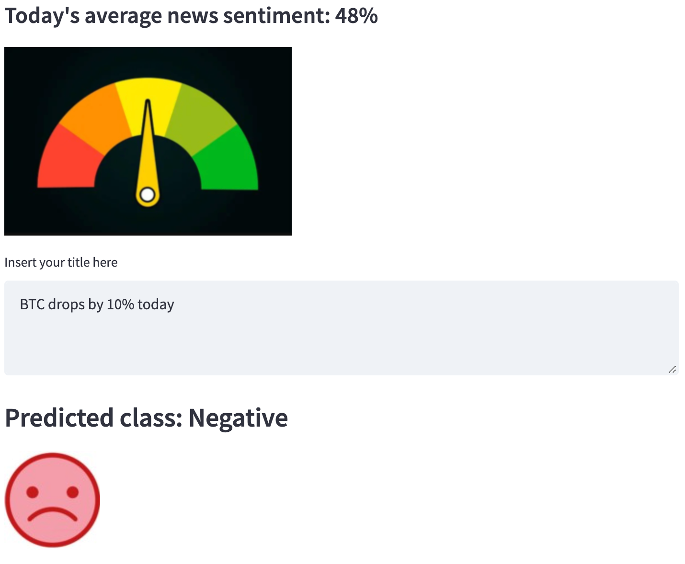

# Cryptonews sentiment demo app

This is a demo cryptonews sentiment prediction application. Its goal is to create an MVP and also create a prototype for the interaction of all components. The components themselves are mocks at the moment, to be superseded by more advanced ones.

The general idea of the workflow is the following (__bolded__ verbs below correspond to arrows in the diagram above):

- `Database` (PostgreSQL) stores 3 tables: one for raw news titles (title\_id, title, source, timestamsp), one more for model predictions (title\_id, negative, neutral, positive, predicted_class, entropy), and a third one for labeled news titles (title\_id, label, timestamsp)
- `Crawler` periodically __scrapes__ 50 latest news from [https://bitcointicker.co/news/](https://bitcointicker.co/news/) and __writes__ this data to the `Database`;
- `ML model API` service hosts the ML model inference API (model training is not covered here);
- the `Model Scorer` service periodically __reads__ those news titles from the `Database` that lack model predictions, __invokes__ `ML model API` for these fresh titles and __writes__ the result to the `Database`;
- `Frontend` __reads__ a metric (average sentiment score for all news titles for the current date) from the `Database` and visualizes it as a barometer. Also, users __interact__ with `Frontend` by inserting news titles (i.e. free text), for which `Frontend` __invokes__ `ML model API` to show predictions for the corresponding user-input news titles.

## Running the app

All components except for the database are packed together and managed by `docker-compose`. See [`docker-compose.yml`](docker-compose.yml) which lists all services and associated commands. At the moment, the database is spun up separately, manually.

To launch the whole application:

 - install [`docker`](https://docs.docker.com/engine/install/ubuntu/) and [`docker-compose`](https://docs.docker.com/compose/install/). Tested with Docker version 20.10.14 and docker-compose v2.4.1 (make sure it's docker-compose v2 not v1, I had to add the path to docker-compose to the PATH env variable: `export PATH=/usr/libexec/docker/cli-plugins/:$PATH`);
 - add a DB connection string `postgresql://<user>:<pwd>@<host>:<port>/<database>` to the `db_connection.ini` file (for the exact connection string, refer to [this](https://www.notion.so/d8eaed6d640640e59704771f6b12b603) Notion page, limited to project contributors);
 - put the model pickle file into `static/models` (later this will be superseded by MLFlow registry), at the moment the model file `/artifacts/models.logit_tfidf_btc_sentiment.pkl` is stored on the Hostkey machine;
 - run `docker compose -f docker-compose.yml --profile production up --build`.
 This will open a streamlit app `http://<hostname>:8501` in your browser, see a screenshot below in the [Frontend](#frontend) section.

 To train the model:
 - select model config in the conf/config.yaml file. Available configs can be found in the conf/models folder.
 - place data in the data folder. Specify the path to the data in the config (path_to_data key). This will be replaced with reading from a database.
 - make sure that other services are stopped: `docker compose stop` and `docker compose rm`.
 - run `USER=$(id -u) GROUP=$(id -g) docker compose -f docker-compose.yml --profile train up --build`. Model checkpoint will be saved with the path specified with checkpoint_path key in the model config. Onnx model will be saved with the path specified with path_to_model key in the model config.
 - if you would like to train a model while other services are running add `-d` option: `USER=$(id -u) GROUP=$(id -g) docker compose -f docker-compose.yml --profile train up --build -d`

 Using gpu to train a model:
 - enable gpu access with compose: `https://docs.docker.com/compose/gpu-support/`
 - set device: cuda in model's config
 - run `USER=$(id -u) GROUP=$(id -g) docker compose -f docker-compose.yml -f docker-compose.gpu.yml --profile train up --build`

## Components of the architecture

The app includes prototypes of the following components:

- PostgreSQL database for raw, labeled, and model-scored news titles: see `docker-compose.yml`;
- primitive crawler: see [`crypto_sentiment_demo_app/crawler/`](crypto_sentiment_demo_app/crawler/);
- model API endpoint: see [`crypto_sentiment_demo_app/model_inference_api/`](crypto_sentiment_demo_app/model_inference_api/);
- model scoring the news: see [`crypto_sentiment_demo_app/model_scorer/`](crypto_sentiment_demo_app/model_scorer/);
- primitive front end: see [`crypto_sentiment_demo_app/frontend/`](crypto_sentiment_demo_app/frontend/).

Below, we go through each one individually.

### Database

A PostgreSQL database is set up as a `db` service, see `docker-compose.yml` with initialization scripts provided in the `db_setup` folder. (Previously, it was also configured without Docker on the machine provided by Hostkey see [this](https://www.notion.so/d8eaed6d640640e59704771f6b12b603) Notion page, limited to project contributors).

At the moment, there're 3 tables in the `cryptotitles_db` database:

 - `news_titles` – for raw news: `(title_id BIGINT PRIMARY KEY, title VARCHAR(511) NOT NULL, source VARCHAR(72), pub_time TIMESTAMP))`;
 - `model_prediction` – for model scores produced for each news title: `(title_id BIGINT PRIMARY KEY, negative FLOAT, neutral FLOAT, positive FLOAT, predicted_class INTEGER, entropy FLOAT)`.
 - `labeled_news_titles` – for labeled news: `(title_id BIGINT PRIMARY KEY, label FLOAT, pub_time TIMESTAMP))`;

To run Postgres interactive terminal: `psql -U mlooops -d cryptotitles_db -W` (the password is also mentioned on [this](https://www.notion.so/d8eaed6d640640e59704771f6b12b603) Notion page).

Some commands are:

- `\dt` to list tables
- `select * from news_titles`
- `select count(*) from model_predictions`
- etc. see psql shortcuts [here](https://www.geeksforgeeks.org/postgresql-psql-commands/).

### Pgadmin

Once the app is running (`docker compose -f docker-compose.yml --profile production up --build`), visit [http://<IP_ADDRESS>:8050/browser/]() to launch PGAdmin which is the administration and development platform for PostgreSQL.

### Crawler

Source: [`crypto_sentiment_demo_app/crawler/`](crypto_sentiment_demo_app/crawler/)

The 1st version of the crawler uses BeautifulSoup to parse 50 news at a time from [https://bitcointicker.co/news/](https://bitcointicker.co/news/). It then writes news titles to the `news_titles` table and title IDs – to the `model_prediction` table.

This is to be superseded by a more advanced crawler ([Notion ticket](https://www.notion.so/a74951e4e815480584dea7d61ddce6cc?v=dbfdb1207d0e451b827d3c5041ed0cfd&p=d5d0948bde5f43c7b77c5e9329d52980)).

### Model inference API

Source: [`crypto_sentiment_demo_app/model_inference_api/`](crypto_sentiment_demo_app/model_inference_api/)

At the moment, we are running a FastAPI with tf-idf & logreg model based on [this repo](https://github.com/crypto-sentiment/crypto_sentiment_model_fast_api). Model training is not covered here, hence the model file needs to be put into the `static/model` folder prior to spinning up the API.

To be superseded by a more advanced BERT model ([Notion ticket](https://www.notion.so/a74951e4e815480584dea7d61ddce6cc?v=dbfdb1207d0e451b827d3c5041ed0cfd&p=6d47b3b821524a419653151a07cb0ded)).

### Model scorer

Source: [`crypto_sentiment_demo_app/model_scorer/`](crypto_sentiment_demo_app/model_scorer/)

The model scorer service takes those title IDs from the `model_predictions` table that don't yet have predictions (score for `negative`, score for `neutral`, score for `positive`, and `predicted_class`) and calls the Model inference API to run the model against the corresponding titles. It then updates records in the `model_predictions` table to write model predictions into it.

### Frontend

Source: [`crypto_sentiment_demo_app/frontend/`](crypto_sentiment_demo_app/frontend/)

Curently, the streamlit app looks like this:

The frontend itself talks to the database to get the average `positive` score for today's news titles (this will be changed in the future).

This is to be superseded by a more advanced React front end service ([Notion ticket](https://www.notion.so/a74951e4e815480584dea7d61ddce6cc?v=dbfdb1207d0e451b827d3c5041ed0cfd&p=31d73280a5d547bdb8852d3d63d73060)).
